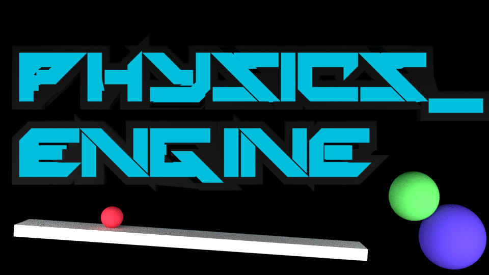

**physics_engine** is a 2D physics engine and editor featuring simulations at multiple scales. 
It was created as a hobbyist project.

# Features
- Time controls (Note that this is still a work in progress.)
- Customizable objects
- Laws of physics including orbits, drag, conservation of momentum, buoyancy etc.

# Dependencies
- [Pygame](https://www.pygame.org/)

# Usage
The engine can be run as a module with the following command:
``$ python -m physics_engine``
Dependencies should be installed automatically.

# Configuration
General settings can be changed in ``physics_engine/data/settings.py`` and the simulation parameters can be changed in ``physics_engine/data/sims.py``.
See the documentation to customize simulations further.

# License
[MIT](https://choosealicense.com/licenses/mit/)
